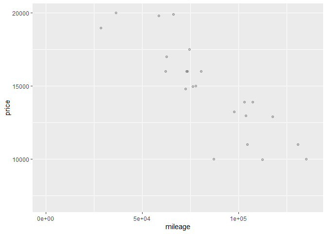

    library(readr)
    ABIA <- read_csv("https://raw.githubusercontent.com/jgscott/ECO395M/master/data/ABIA.csv")

    ## Rows: 99260 Columns: 29
    ## ── Column specification ────────────────────────────────────────────────────────
    ## Delimiter: ","
    ## chr  (5): UniqueCarrier, TailNum, Origin, Dest, CancellationCode
    ## dbl (24): Year, Month, DayofMonth, DayOfWeek, DepTime, CRSDepTime, ArrTime, ...
    ## 
    ## ℹ Use `spec()` to retrieve the full column specification for this data.
    ## ℹ Specify the column types or set `show_col_types = FALSE` to quiet this message.

    View(ABIA)

# A histogram of flight distance faceted by each day of the week (1=Monday, 7=Sunday)

    library(ggplot2)
    library(tidyverse)

    ## ── Attaching packages ─────────────────────────────────────── tidyverse 1.3.1 ──

    ## ✔ tibble  3.1.7     ✔ dplyr   1.0.9
    ## ✔ tidyr   1.2.0     ✔ stringr 1.4.0
    ## ✔ purrr   0.3.4     ✔ forcats 0.5.1

    ## ── Conflicts ────────────────────────────────────────── tidyverse_conflicts() ──
    ## ✖ dplyr::filter() masks stats::filter()
    ## ✖ dplyr::lag()    masks stats::lag()

    ggplot(data = ABIA) + geom_histogram(aes(x=Distance), binwidth = 100) + facet_wrap(~DayOfWeek)

 \#
While the distribution of flight distance remains similar throughout the
week, the total number of filghts appears to decrease until Sunday.

    library(readr)
    olympics_top20 <- read_csv("https://raw.githubusercontent.com/jgscott/ECO395M/master/data/olympics_top20.csv")

    ## Rows: 23850 Columns: 15
    ## ── Column specification ────────────────────────────────────────────────────────
    ## Delimiter: ","
    ## chr (10): name, sex, team, noc, games, season, city, sport, event, medal
    ## dbl  (5): id, age, height, weight, year
    ## 
    ## ℹ Use `spec()` to retrieve the full column specification for this data.
    ## ℹ Specify the column types or set `show_col_types = FALSE` to quiet this message.

    View(olympics_top20)

# Part A: 95th percentile of female heights across all sports (Basketball is tallest)

    olympics_heightf = olympics_top20 %>%
    group_by(sex, sport) %>%
    summarize(q95_height = quantile(height, 0.95))

    ## `summarise()` has grouped output by 'sex'. You can override using the `.groups`
    ## argument.

# Part B: Highest female variability in height is 10.87 (“Rowing Women’s Coexed Fours”)

    olympics_sdf = olympics_top20 %>%
    group_by(sex, event) %>%
    summarize(sd_height = sd(height)) %>%
    arrange(sd_height)

    ## `summarise()` has grouped output by 'sex'. You can override using the `.groups`
    ## argument.

# Part C: Before women competed, mean age increased dramatiacally for men, then fell back down to the 20-25 years old interval. Mean age for women has remained slightly below men over time.

    olympics_age = olympics_top20 %>%
    group_by(year, sex) %>%
    filter(sport == "Swimming") %>%
    summarize(avg_age = mean(age))

    ## `summarise()` has grouped output by 'year'. You can override using the
    ## `.groups` argument.

    ggplot(data = olympics_age) + geom_line(aes(x=year, y=avg_age, color=sex)) + ggtitle("Mean age of Olympic swimmers over time by sex")

    library(readr)
    sclass <- read_csv("https://raw.githubusercontent.com/jgscott/ECO395M/master/data/sclass.csv")

    ## Rows: 29466 Columns: 17
    ## ── Column specification ────────────────────────────────────────────────────────
    ## Delimiter: ","
    ## chr (11): trim, subTrim, condition, color, displacement, fuel, state, region...
    ## dbl  (5): id, mileage, year, featureCount, price
    ## lgl  (1): isOneOwner
    ## 
    ## ℹ Use `spec()` to retrieve the full column specification for this data.
    ## ℹ Specify the column types or set `show_col_types = FALSE` to quiet this message.

    View(sclass)

# Get two separate models for both trims

    sclass_350 = sclass %>%
    filter(trim == "350")

    sclass_65AMG = sclass %>%
    filter(trim == "65 AMG")

# Create train test split for 350 trim and find right value for k in knn

    library(tidyverse)
    library(ggplot2)
    library(rsample)

    ## Warning: package 'rsample' was built under R version 4.2.2

    library(caret)

    ## Warning: package 'caret' was built under R version 4.2.2

    ## Loading required package: lattice

    ## 
    ## Attaching package: 'caret'

    ## The following object is masked from 'package:purrr':
    ## 
    ##     lift

    library(modelr)
    library(parallel)
    library(foreach)

    ## Warning: package 'foreach' was built under R version 4.2.2

    ## 
    ## Attaching package: 'foreach'

    ## The following objects are masked from 'package:purrr':
    ## 
    ##     accumulate, when

    sclass_350_split = initial_split(sclass_350, prop=0.8)
    sclass_350_train = training(sclass_350_split)
    sclass_350_test = testing(sclass_350_split)

    knn2 = knnreg(price ~ mileage, data=sclass_350_train, k=2)
    rmse(knn2, sclass_350_test)

    ## [1] 10589.35

    rmse_out2 = foreach(i=1:10, combine('c')) %do% {
      sclass_350_split = initial_split(sclass_350, prop=0.8)
      sclass_350_train = training(sclass_350_split)
      sclass_350_test = testing(sclass_350_split)
      
      knn2 = knnreg(price ~ mileage, data=sclass_350_train, k=2)
      rmse(knn2, sclass_350_test)
    }

    ## Warning: `combine()` was deprecated in dplyr 1.0.0.
    ## ℹ Please use `vctrs::vec_c()` instead.

    knn5 = knnreg(price ~ mileage, data=sclass_350_train, k=5)
    rmse(knn5, sclass_350_test)

    ## [1] 9919.813

    rmse_out5 = foreach(i=1:10, combine('c')) %do% {
      sclass_350_split = initial_split(sclass_350, prop=0.8)
      sclass_350_train = training(sclass_350_split)
      sclass_350_test = testing(sclass_350_split)
      
      knn5 = knnreg(price ~ mileage, data=sclass_350_train, k=5)
      rmse(knn5, sclass_350_test)
    }

    knn10 = knnreg(price ~ mileage, data=sclass_350_train, k=10)
    rmse(knn10, sclass_350_test)

    ## [1] 10668.76

    rmse_out10 = foreach(i=1:10, combine('c')) %do% {
      sclass_350_split = initial_split(sclass_350, prop=0.8)
      sclass_350_train = training(sclass_350_split)
      sclass_350_test = testing(sclass_350_split)
      
      knn10 = knnreg(price ~ mileage, data=sclass_350_train, k=10)
      rmse(knn10, sclass_350_test)
    }

    knn20 = knnreg(price ~ mileage, data=sclass_350_train, k=20)
    rmse(knn20, sclass_350_test)

    ## [1] 9596.038

    rmse_out20 = foreach(i=1:10, combine('c')) %do% {
      sclass_350_split = initial_split(sclass_350, prop=0.8)
      sclass_350_train = training(sclass_350_split)
      sclass_350_test = testing(sclass_350_split)
      
      knn20 = knnreg(price ~ mileage, data=sclass_350_train, k=20)
      rmse(knn20, sclass_350_test)
    }

    knn25 = knnreg(price ~ mileage, data=sclass_350_train, k=25)
    rmse(knn25, sclass_350_test)

    ## [1] 10655.89

    rmse_out25 = foreach(i=1:10, combine('c')) %do% {
      sclass_350_split = initial_split(sclass_350, prop=0.8)
      sclass_350_train = training(sclass_350_split)
      sclass_350_test = testing(sclass_350_split)
      
      knn25 = knnreg(price ~ mileage, data=sclass_350_train, k=25)
      rmse(knn25, sclass_350_test)
    }

    knn30 = knnreg(price ~ mileage, data=sclass_350_train, k=30)
    rmse(knn30, sclass_350_test)

    ## [1] 9941.631

    rmse_out30 = foreach(i=1:10, combine('c')) %do% {
      sclass_350_split = initial_split(sclass_350, prop=0.8)
      sclass_350_train = training(sclass_350_split)
      sclass_350_test = testing(sclass_350_split)
      
      knn30 = knnreg(price ~ mileage, data=sclass_350_train, k=30)
      rmse(knn30, sclass_350_test)
    }

    knn35 = knnreg(price ~ mileage, data=sclass_350_train, k=35)
    rmse(knn35, sclass_350_test)

    ## [1] 11455.33

    rmse_out35 = foreach(i=1:10, combine('c')) %do% {
      sclass_350_split = initial_split(sclass_350, prop=0.8)
      sclass_350_train = training(sclass_350_split)
      sclass_350_test = testing(sclass_350_split)
      
      knn35 = knnreg(price ~ mileage, data=sclass_350_train, k=35)
      rmse(knn35, sclass_350_test)
    }

    knn40 = knnreg(price ~ mileage, data=sclass_350_train, k=40)
    rmse(knn40, sclass_350_test)

    ## [1] 11128.37

    rmse_out40 = foreach(i=1:10, combine('c')) %do% {
      sclass_350_split = initial_split(sclass_350, prop=0.8)
      sclass_350_train = training(sclass_350_split)
      sclass_350_test = testing(sclass_350_split)
      
      knn40 = knnreg(price ~ mileage, data=sclass_350_train, k=40)
      rmse(knn40, sclass_350_test)
    }

# Run k-fold cross-validation to plot RMSE vs. k

    K_folds = 5
    sclass_350 = sclass_350 %>%
      mutate(fold_id = rep(1:K_folds, length = nrow(sclass_350)) %>% sample)

    head(sclass_350)

    ## # A tibble: 6 × 18
    ##      id trim  subTrim condition isOneOwner mileage  year color  displacement
    ##   <dbl> <chr> <chr>   <chr>     <lgl>        <dbl> <dbl> <chr>  <chr>       
    ## 1   282 350   unsp    CPO       FALSE        21929  2012 Black  3.0 L       
    ## 2   284 350   unsp    CPO       FALSE        17770  2012 Silver 3.0 L       
    ## 3   285 350   unsp    Used      FALSE        29108  2012 Black  3.0 L       
    ## 4   288 350   unsp    CPO       FALSE        35004  2013 White  3.0 L       
    ## 5   289 350   unsp    Used      TRUE         66689  2012 Black  3.0 L       
    ## 6   290 350   unsp    CPO       FALSE        19567  2012 Black  3.0 L       
    ## # … with 9 more variables: fuel <chr>, state <chr>, region <chr>,
    ## #   soundSystem <chr>, wheelType <chr>, wheelSize <chr>, featureCount <dbl>,
    ## #   price <dbl>, fold_id <int>

    rmse_cv = foreach(fold = 1:K_folds, .combine = 'c') %do% {
      knn35 = knnreg(price ~ mileage, data=filter(sclass_350, fold_id != fold), k=35)
      modelr::rmse(knn35, data=filter(sclass_350, fold_id == fold))
    }

    rmse_cv

    ## [1] 11897.750  8846.109 10322.561 11444.536  8867.596

    mean(rmse_cv)

    ## [1] 10275.71

    sd(rmse_cv)/sqrt(K_folds)

    ## [1] 633.4787

    sclass350_folds = crossv_kfold(sclass_350, k=K_folds)
    models = map(sclass350_folds$train, ~ knnreg(price ~ mileage, k=35, data = ., use.all=FALSE))

    errs = map2_dbl(models, sclass350_folds$test, modelr::rmse)

    mean(errs)

    ## [1] 10145.97

    sd(errs)/sqrt(K_folds)

    ## [1] 550.7055

    k_grid = c(2, 4, 6, 8, 10, 15, 20, 25, 30, 35, 40, 45, 50, 60, 70, 80, 90, 100, 125, 150, 175, 200, 250, 300)

    cv_grid = foreach(k = k_grid, .combine='rbind') %dopar% {
      models = map(sclass350_folds$train, ~ knnreg(price ~ mileage, k=k, data = ., use.all=FALSE))
      errs = map2_dbl(models, sclass350_folds$test, modelr::rmse)
      c(k=k, err = mean(errs), std_err = sd(errs)/sqrt(K_folds))
    } %>% as.data.frame

    ## Warning: executing %dopar% sequentially: no parallel backend registered

    head(cv_grid)

    ##           k       err  std_err
    ## result.1  2 11678.970 663.5209
    ## result.2  4 10640.300 633.2268
    ## result.3  6 10300.989 705.3514
    ## result.4  8 10131.712 616.2927
    ## result.5 10 10004.738 556.3181
    ## result.6 15  9895.636 472.3875

    ggplot(cv_grid) + geom_point(aes(x=k, y=err)) + geom_errorbar(aes(x=k, ymin = err-std_err, ymax = err+std_err)) + scale_x_log10()

 \#
Plot the fitted model of price (k=35) vs. x

    sclass_350_test = sclass_350_test %>%
      mutate(price_pred = predict(knn35, sclass_350_test))

    p_test = ggplot(data = sclass_350_test) + geom_point(mapping = aes(x=mileage, y=price), alpha = 0.2) + ylim(7000, 20000)
    p_test

    ## Warning: Removed 64 rows containing missing values (geom_point).

    p_test + geom_line(aes(x=mileage, y=price_pred), color='green', size=1.5)

    ## Warning: Removed 64 rows containing missing values (geom_point).

    ## Warning: Removed 75 row(s) containing missing values (geom_path).

# Run the same process for the “65 AMG” trim (k=13)

    sclass_65AMG_split = initial_split(sclass_350, prop=0.8)
    sclass_65AMG_train = training(sclass_350_split)
    sclass_65AMG_test = testing(sclass_350_split)

    knn2 = knnreg(price ~ mileage, data=sclass_65AMG_train, k=2)
    rmse(knn2, sclass_65AMG_test)

    ## [1] 13555.61

    rmse_out2 = foreach(i=1:10, combine('c')) %do% {
      sclass_65AMG_split = initial_split(sclass_65AMG, prop=0.8)
      sclass_65AMG_train = training(sclass_65AMG_split)
      sclass_65AMG_test = testing(sclass_65AMG_split)
      
      knn2 = knnreg(price ~ mileage, data=sclass_65AMG_train, k=2)
      rmse(knn2, sclass_65AMG_test)
    }

    knn15 = knnreg(price ~ mileage, data=sclass_65AMG_train, k=15)
    rmse(knn15, sclass_65AMG_test)

    ## [1] 15605.53

    rmse_out15 = foreach(i=1:10, combine('c')) %do% {
      sclass_65AMG_split = initial_split(sclass_65AMG, prop=0.8)
      sclass_65AMG_train = training(sclass_65AMG_split)
      sclass_65AMG_test = testing(sclass_65AMG_split)
      
      knn15 = knnreg(price ~ mileage, data=sclass_65AMG_train, k=15)
      rmse(knn15, sclass_65AMG_test)
    }

    knn25 = knnreg(price ~ mileage, data=sclass_65AMG_train, k=25)
    rmse(knn25, sclass_65AMG_test)

    ## [1] 28380.77

    rmse_out25 = foreach(i=1:10, combine('c')) %do% {
      sclass_65AMG_split = initial_split(sclass_65AMG, prop=0.8)
      sclass_65AMG_train = training(sclass_65AMG_split)
      sclass_65AMG_test = testing(sclass_65AMG_split)
      
      knn25 = knnreg(price ~ mileage, data=sclass_65AMG_train, k=25)
      rmse(knn25, sclass_65AMG_test)
    }

    K_folds = 5
    sclass_65AMG = sclass_65AMG %>%
      mutate(fold_id = rep(1:K_folds, length = nrow(sclass_65AMG)) %>% sample)

    head(sclass_65AMG)

    ## # A tibble: 6 × 18
    ##      id trim   subTrim condition isOneOwner mileage  year color  displacement
    ##   <dbl> <chr>  <chr>   <chr>     <lgl>        <dbl> <dbl> <chr>  <chr>       
    ## 1  1060 65 AMG unsp    New       FALSE          106  2015 Black  6.0 L       
    ## 2  1062 65 AMG unsp    New       FALSE           11  2015 Black  6.0 L       
    ## 3  1387 65 AMG unsp    Used      FALSE        74461  2006 Silver 6.0 L       
    ## 4  2068 65 AMG unsp    Used      FALSE        73415  2007 Gray   6.0 L       
    ## 5  2141 65 AMG unsp    CPO       FALSE        17335  2011 Black  6.0 L       
    ## 6  2310 65 AMG unsp    New       FALSE            7  2015 White  6.0 L       
    ## # … with 9 more variables: fuel <chr>, state <chr>, region <chr>,
    ## #   soundSystem <chr>, wheelType <chr>, wheelSize <chr>, featureCount <dbl>,
    ## #   price <dbl>, fold_id <int>

    rmse_cvv = foreach(fold = 1:K_folds, .combine = 'c') %do% {
      knn15 = knnreg(price ~ mileage, data=filter(sclass_65AMG, fold_id != fold), k=15)
      modelr::rmse(knn35, data=filter(sclass_350, fold_id == fold))
    }

    rmse_cvv

    ## [1] 11296.859  8726.312 10038.025 10961.310  8867.596

    mean(rmse_cvv)

    ## [1] 9978.02

    sd(rmse_cvv)/sqrt(K_folds)

    ## [1] 524.8624

    sclass65AMG_folds = crossv_kfold(sclass_65AMG, k=K_folds)
    models = map(sclass65AMG_folds$train, ~ knnreg(price ~ mileage, k=15, data = ., use.all=FALSE))

    errs = map2_dbl(models, sclass65AMG_folds$test, modelr::rmse)

    mean(errs)

    ## [1] 20758.88

    sd(errs)/sqrt(K_folds)

    ## [1] 2117.029

    k_grid = c(2, 4, 6, 8, 10, 15, 20, 25, 30, 35, 40, 45, 50, 60, 70, 80, 90, 100, 125, 150, 175, 200, 250, 300)

    cv_grid = foreach(k = k_grid, .combine='rbind') %dopar% {
      models = map(sclass65AMG_folds$train, ~ knnreg(price ~ mileage, k=k, data = ., use.all=FALSE))
      errs = map2_dbl(models, sclass65AMG_folds$test, modelr::rmse)
      c(k=k, err = mean(errs), std_err = sd(errs)/sqrt(K_folds))
    } %>% as.data.frame

    ## Warning in knnregTrain(train = structure(c(106, 11, 73415, 17335, 7, 61500, : k
    ## = 250 exceeds number 233 of patterns

    ## Warning in knnregTrain(train = structure(c(106, 11, 74461, 73415, 17335, : k =
    ## 250 exceeds number 233 of patterns

    ## Warning in knnregTrain(train = structure(c(106, 74461, 73415, 17335, 48398, : k
    ## = 250 exceeds number 234 of patterns

    ## Warning in knnregTrain(train = structure(c(11, 74461, 73415, 7, 48398, 49515, :
    ## k = 250 exceeds number 234 of patterns

    ## Warning in knnregTrain(train = structure(c(106, 11, 74461, 17335, 7, 48398, : k
    ## = 250 exceeds number 234 of patterns

    ## Warning in knnregTrain(train = structure(c(106, 11, 73415, 17335, 7, 61500, : k
    ## = 300 exceeds number 233 of patterns

    ## Warning in knnregTrain(train = structure(c(106, 11, 74461, 73415, 17335, : k =
    ## 300 exceeds number 233 of patterns

    ## Warning in knnregTrain(train = structure(c(106, 74461, 73415, 17335, 48398, : k
    ## = 300 exceeds number 234 of patterns

    ## Warning in knnregTrain(train = structure(c(11, 74461, 73415, 7, 48398, 49515, :
    ## k = 300 exceeds number 234 of patterns

    ## Warning in knnregTrain(train = structure(c(106, 11, 74461, 17335, 7, 48398, : k
    ## = 300 exceeds number 234 of patterns

    head(cv_grid)

    ##           k      err  std_err
    ## result.1  2 24029.76 1495.585
    ## result.2  4 21820.49 1729.809
    ## result.3  6 21476.65 1925.811
    ## result.4  8 20905.12 1867.080
    ## result.5 10 20741.29 1879.094
    ## result.6 15 20758.88 2117.029

    ggplot(cv_grid) + geom_point(aes(x=k, y=err)) + geom_errorbar(aes(x=k, ymin = err-std_err, ymax = err+std_err)) + scale_x_log10()

    knn13 = knnreg(price ~ mileage, data=sclass_65AMG_train, k=13)
    rmse(knn13, sclass_65AMG_test)

    ## [1] 15010.27

    sclass_65AMG_test = sclass_65AMG_test %>%
      mutate(price_pred = predict(knn13, sclass_65AMG_test))

    p_test = ggplot(data = sclass_65AMG_test) + geom_point(mapping = aes(x=mileage, y=price), alpha = 0.8) + ylim(7000, 20000)
    p_test

    ## Warning: Removed 59 rows containing missing values (geom_point).

    p_test + geom_line(aes(x=mileage, y=price_pred), color='green', size=1.5)

    ## Warning: Removed 59 rows containing missing values (geom_point).

    ## Warning: Removed 59 row(s) containing missing values (geom_path).

